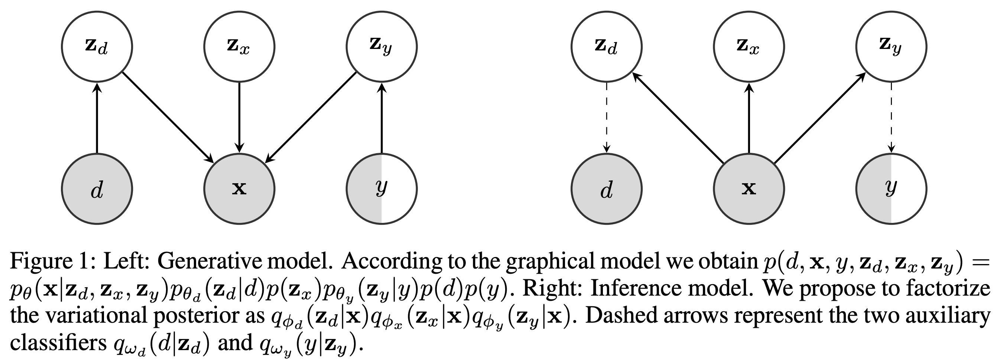

DIVA: Domain Invariant Variational Autoencoders
================================================
by Maximilian Ilse (<ilse.maximilian@gmail.com>) and Jakub M. Tomczak, Christos Louizos and Max Welling



DIVA without z_d
----------------
As described in Appendix 5.1.7 while losing a good amount of interpretability, DIVA works even without z_d. Resulting in a, especially from an optimization perspective, simpler model. The code for a simpler DIVA is included in this repository as well.

Overview
--------

PyTorch implementation of our paper 'DIVA: Domain Invariant Variational Autoencoders'
* Ilse, M., Tomczak, J. M., C. Louizos & Welling, M. (2018). DIVA: Domain Invariant Variational Autoencoders. arXiv preprint arXiv:1905.10427. [link](https://arxiv.org/abs/1905.10427).

Used modules
------------

- Python 3.6
- PyTorch 1.0.1
- Scikit-image 0.14.1
- Scikit-learn 0.19.1
- Seaborn 0.9.0

Malaria cell images
-------------------

The malaria cell images dataset can be found here: https://lhncbc.nlm.nih.gov/publication/pub9932


Questions and Issues
--------------------

If you find any bugs or have any questions about this code please contact Maximilian. We cannot guarantee any support for this software.

Citation
--------------------

Please cite our paper if you use this code in your research:
```
@article{ilse_diva:_2019,
	title = {{DIVA}: {Domain} {Invariant} {Variational} {Autoencoders}},
	author = {Ilse, Maximilian and Tomczak, Jakub M. and Louizos, Christos and Welling, Max},
	journal = {arXiv:1905.10427 [cs, stat]},
	year = {2019}
}
```

Acknowledgments
--------------------

The work conducted by Maximilian Ilse was funded by the Nederlandse Organisatie voor Wetenschappelijk Onderzoek (Grant DLMedIa: Deep Learning for Medical Image Analysis).

The work conducted by Jakub Tomczak was funded by the European Commission within the Marie Skodowska-Curie Individual Fellowship (Grant No. 702666, ”Deep learning and Bayesian inference for medical imaging”).
